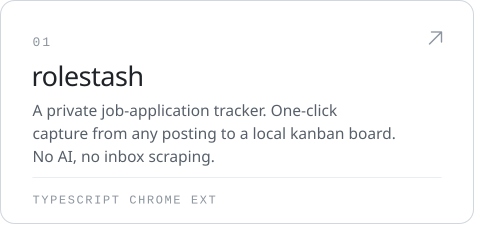
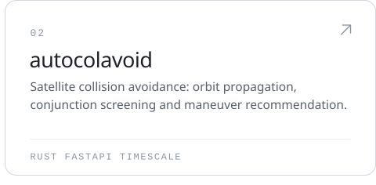
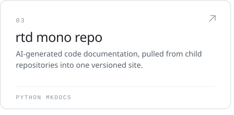
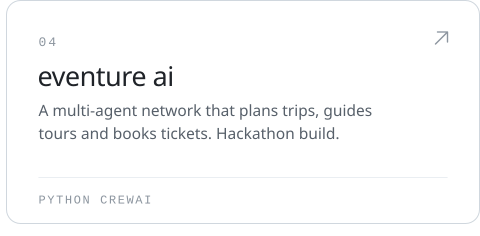
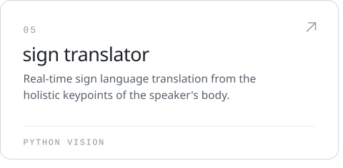
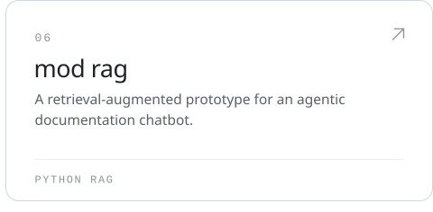
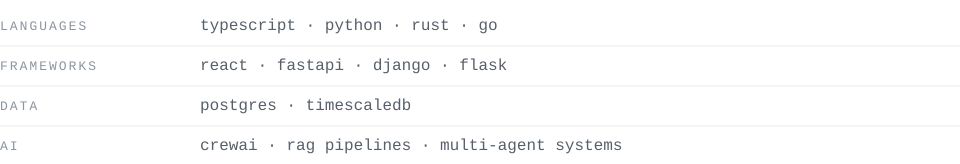

<picture><source media="(prefers-color-scheme: dark)" srcset="assets/header-dark.svg"></picture>

 

I build across the stack, from browser extensions to backend services to the occasional Rust engine. I like things that are small, private by default, and quiet to use. I start more than I finish, and some of it ships.

  

<picture><source media="(prefers-color-scheme: dark)" srcset="assets/section-now-dark.svg"></picture>

<a href="https://github.com/SHINO-01/rolestash"><picture><source media="(prefers-color-scheme: dark)" srcset="assets/card-rolestash-dark.svg"></picture></a><a href="https://github.com/SHINO-01/AutoColAvoid"><picture><source media="(prefers-color-scheme: dark)" srcset="assets/card-autocolavoid-dark.svg"></picture></a>

 

<picture><source media="(prefers-color-scheme: dark)" srcset="assets/section-before-dark.svg"></picture>

<a href="https://github.com/SHINO-01/RTD_MONO_REPO"><picture><source media="(prefers-color-scheme: dark)" srcset="assets/card-rtd-mono-repo-dark.svg"></picture></a><a href="https://github.com/SHINO-01/EventureAI-W3-Hackathon"><picture><source media="(prefers-color-scheme: dark)" srcset="assets/card-eventure-ai-dark.svg"></picture></a> <a href="https://github.com/SHINO-01/SignTranslator"><picture><source media="(prefers-color-scheme: dark)" srcset="assets/card-sign-translator-dark.svg"></picture></a><a href="https://github.com/SHINO-01/Mod_RAG"><picture><source media="(prefers-color-scheme: dark)" srcset="assets/card-mod-rag-dark.svg"></picture></a>

 

<picture><source media="(prefers-color-scheme: dark)" srcset="assets/section-tools-dark.svg"></picture>

<picture><source media="(prefers-color-scheme: dark)" srcset="assets/tools-dark.svg"></picture>

  

<picture><source media="(prefers-color-scheme: dark)" srcset="assets/footer-dark.svg"></picture>
